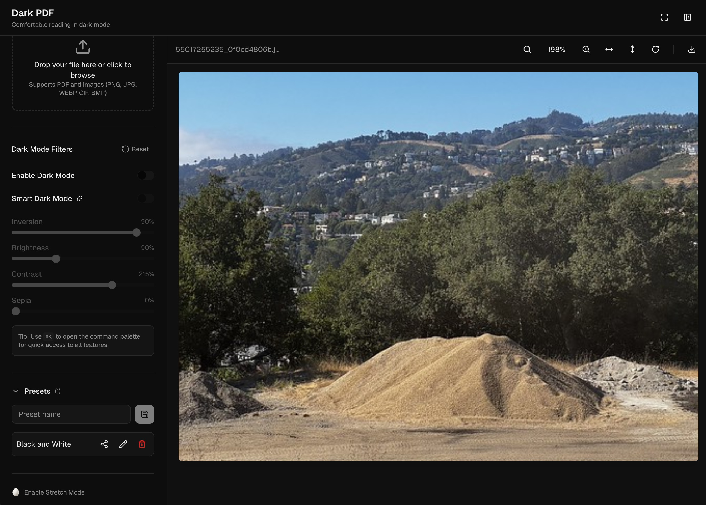

# Dark PDF

A web app for reading PDFs and images comfortably in dark mode with customizable filters.



## Features

- **Dark Mode Filters** - Adjustable inversion, brightness, contrast, and sepia
- **Color Preserve Mode** - Preserves image hues while inverting luminosity using hue rotation
- **PDF & Image Support** - Load PDFs or images (PNG, JPG, WEBP, GIF, BMP)
- **Export with Filters** - Save files with your filter settings applied (same format as input)
- **Presets** - Save and load your favorite filter configurations (collapsible panel)
- **Clickable Links** - Internal page links and external URLs work as expected
- **Deep Zoom** - Zoom up to 900% with horizontal scrolling
- **Drag to Pan** - Click and drag to navigate when zoomed in
- **Command Palette** - Press `⌘K` / `Ctrl+K` for quick access to all features
- **Zen Mode** - Distraction-free reading with minimal floating controls
- **OCR Support** - Extract text from scanned PDFs using Tesseract.js
- **Session Persistence** - Remembers your page, zoom, and filter settings per document
- **Shareable Configs** - Deep link your filter settings via URL parameters
- **Global Drag & Drop** - Drop PDFs anywhere on the screen to open them
- **Jump to Page** - Click the page counter to quickly navigate to any page
- **Keyboard Shortcuts** - Navigate and zoom with keyboard
- **URL or File Upload** - Load PDFs from URLs or local files
- **CORS Proxy** - Built-in proxy for loading PDFs from external URLs
- **Responsive** - Works on desktop and mobile

## Keyboard Shortcuts

| Key | Action |
|-----|--------|
| ← / → | Previous / Next page |
| + / - | Zoom in / out |
| r | Rotate |
| ⌘K / Ctrl+K | Open command palette |
| Esc | Exit Zen Mode |

## URL Parameters

Share your filter configuration via URL:

```
?dm=1&sdm=0&inv=90&br=90&ct=90&sp=10&p=5
```

| Param | Description |
|-------|-------------|
| dm | Dark mode (1/0) |
| sdm | Color preserve mode (1/0) |
| inv | Inversion (0-100) |
| br | Brightness (0-300) |
| ct | Contrast (0-300) |
| sp | Sepia (0-100) |
| p | Page number |

## Getting Started

### Prerequisites

- Node.js 18+
- npm or yarn

### Installation

```bash
# Clone the repository
git clone https://github.com/benjifriedman/dark-pdf.git
cd dark-pdf

# Install dependencies
npm install

# Start development server
npm run dev
```

Open [http://localhost:3000](http://localhost:3000) in your browser.

### Build for Production

```bash
npm run build
npm start
```

## Tech Stack

- [Next.js 16](https://nextjs.org/) - React framework
- [Tailwind CSS](https://tailwindcss.com/) - Styling
- [shadcn/ui](https://ui.shadcn.com/) - UI components
- [PDF.js](https://mozilla.github.io/pdf.js/) - PDF rendering (loaded from CDN)
- [jsPDF](https://github.com/parallax/jsPDF) - PDF export
- [Tesseract.js](https://tesseract.projectnaptha.com/) - OCR
- [cmdk](https://cmdk.paco.me/) - Command palette

## License

MIT License

## Acknowledgments

- [PDF.js](https://mozilla.github.io/pdf.js/) by Mozilla
- [shadcn/ui](https://ui.shadcn.com/) for the beautiful components
